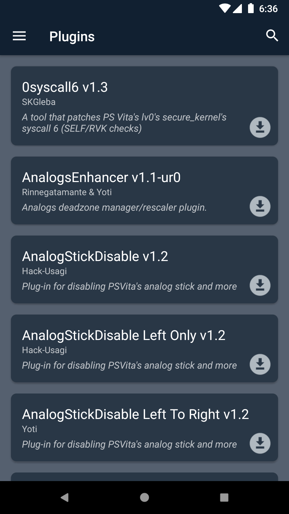
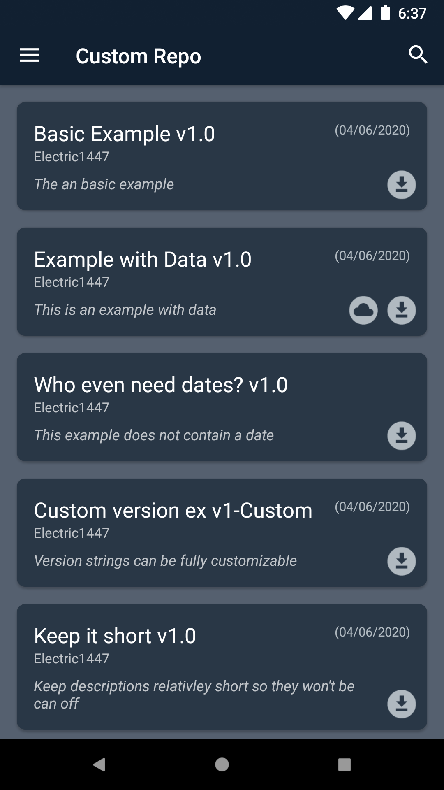
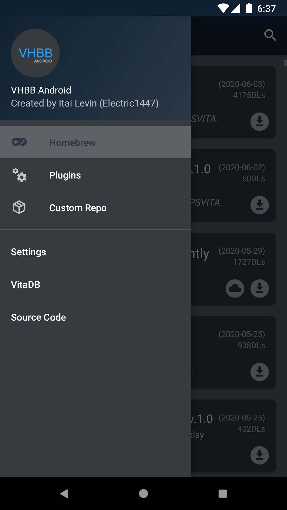

# VHBB-Android
Vita Homebrew Browser client for Android

### Features:
- See all homebrew from VitaDB.
- Custom plugin database containing 95% of all vita plugins
- Download homebrew & plugins to your Android device.
- Search
- You can get homebrew/plugin from custom repositories

### Requirements:
- Android device running Android 5.0 Lolipop or higher.
- Internet connection

## Screenshots
 &nbsp;  &nbsp;   &nbsp; 
