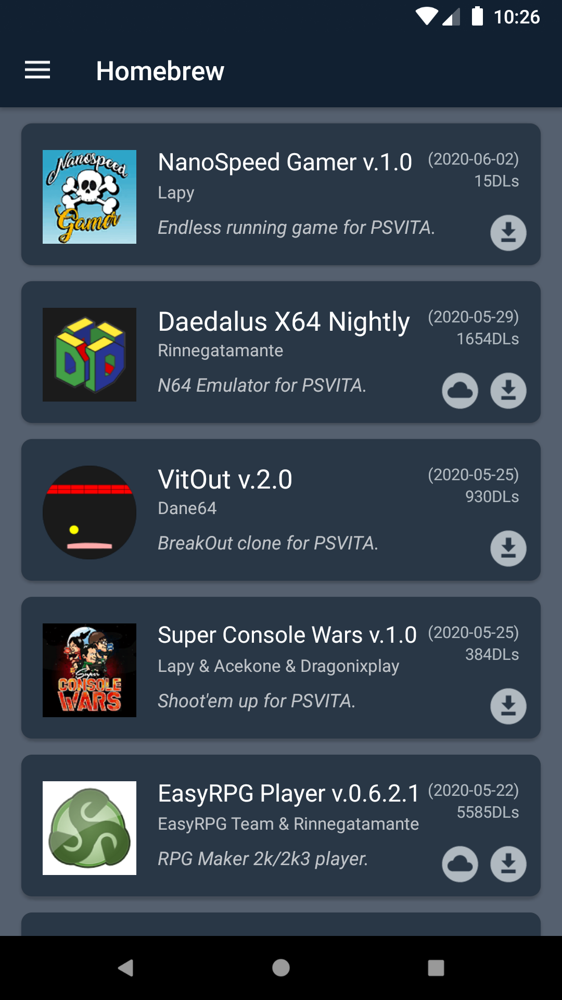
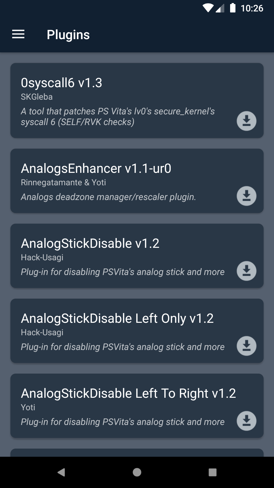
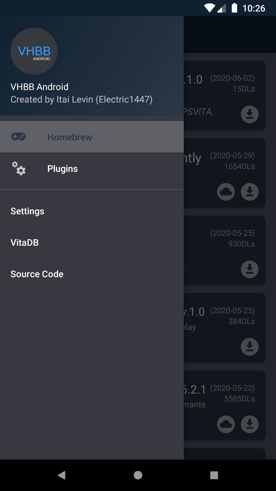

# VHBB-Android
VitaDB client for Android

### Features:
- See all homebrew from VitaDB.
- Custom plugin database containing 95% of all vita plugins
- Download homebrew & plugins to your Android device.
- Search

### Requirements:
- Android device running Android 5.0 Lolipop or higher.
- Internet connection

## Screenshots
 &nbsp;  &nbsp; 
